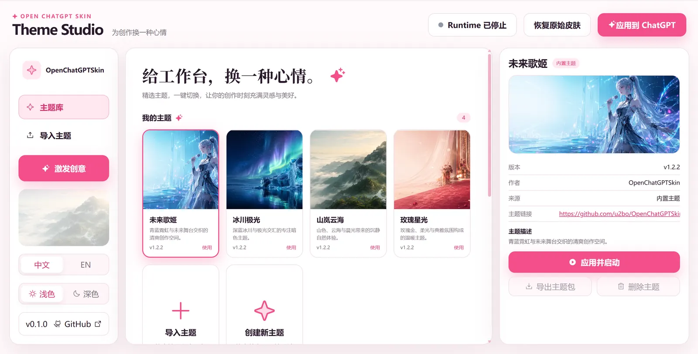
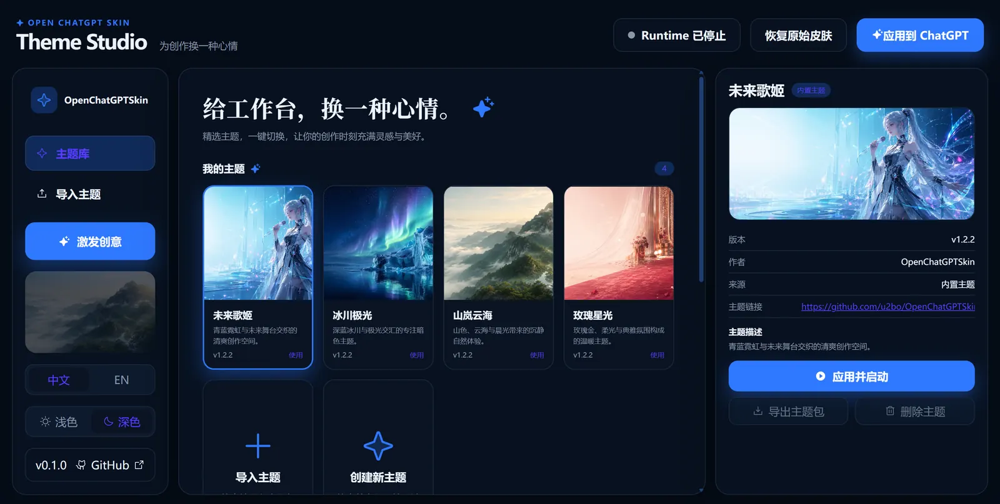
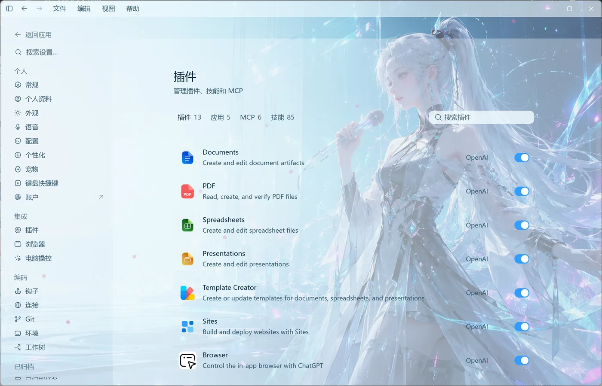
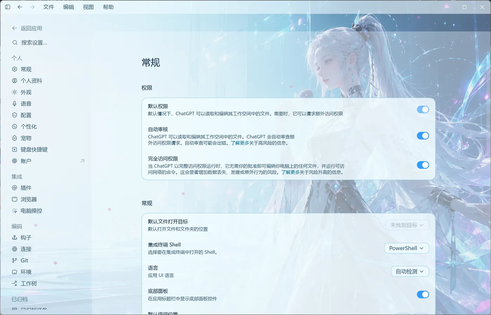
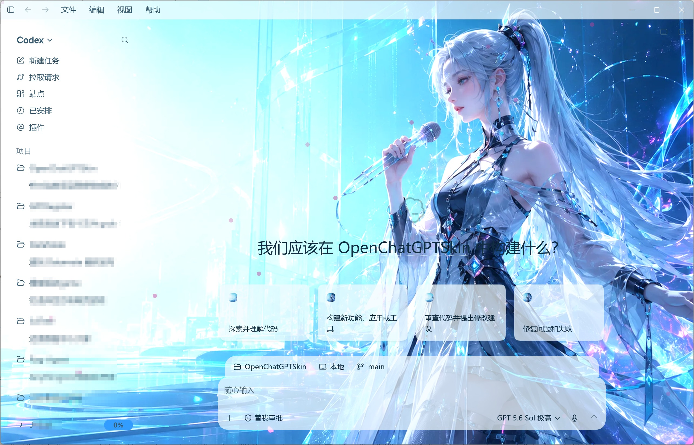
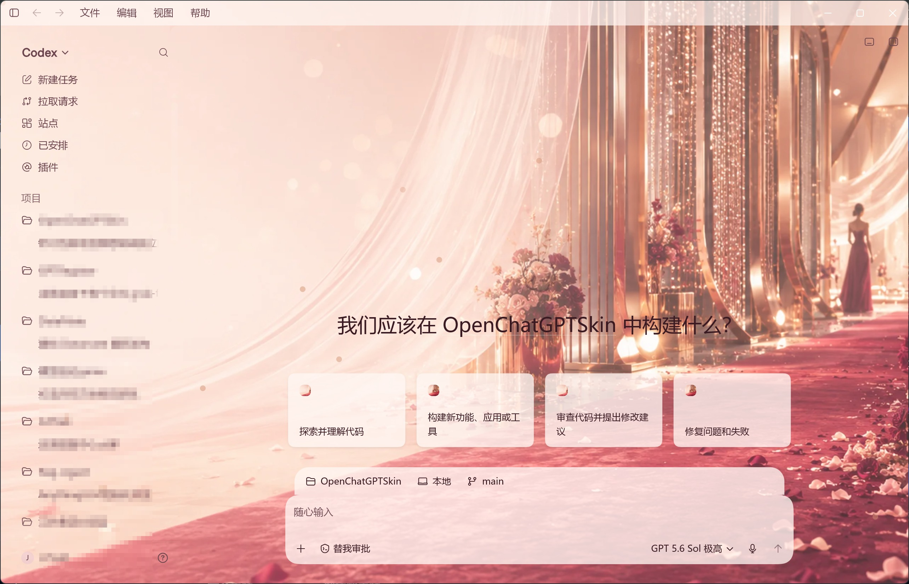
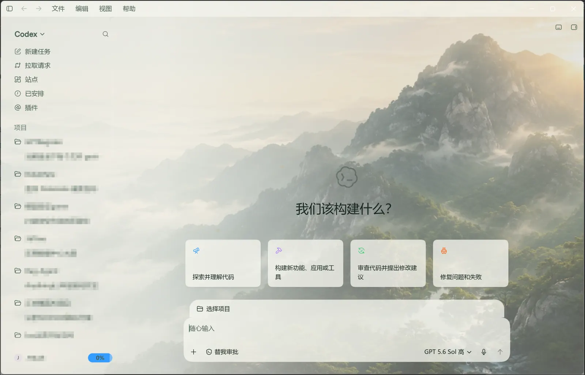
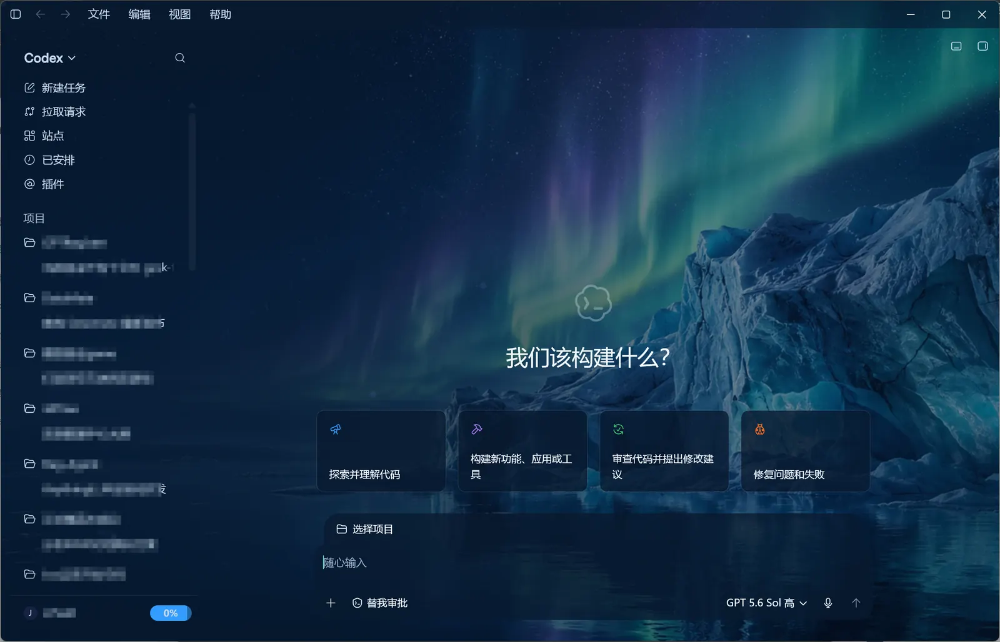

# OpenChatGPTSkin

[简体中文](README.md) · [English](README.en.md)


[](https://linux.do/)

**OpenChatGPTSkin is an open-source theme system for Codex Desktop. It does more than replace the home-page background: one color, background, typography, decoration, and safe-layout model is projected across every Codex UI surface currently recognized by the Runtime.**

### Theme Studio home previews

<table>
  <tr>
    <td width="50%"></td>
    <td width="50%"></td>
  </tr>
  <tr>
    <td align="center">Light home</td>
    <td align="center">Dark home</td>
  </tr>
</table>

<details>
  <summary>View the Theme Studio editor workspace</summary>
  <br>
  
</details>

> [!IMPORTANT]
> `v0.1.0-alpha.1` is a **Windows developer preview** with a Windows x64 portable ZIP and per-user Setup. Both bundle Node.js and require neither Git nor development dependencies. macOS remains a source preview and is not attached to the public Release until real-Mac, signing, and Gatekeeper acceptance is complete. Save your work and **fully quit the regular Codex app** before applying or restoring a theme. OpenChatGPTSkin manages only the Codex instance it launches and never modifies `WindowsApps`, `Codex.app`, `app.asar`, account settings, or API configuration.

## Contents

- [Overview](#overview)
- [Features](#features)
- [Full UI coverage](#full-ui-coverage)
- [Built-in themes](#built-in-themes)
- [Installation](#installation)
- [Quick start](#quick-start)
- [Custom themes](#custom-themes)
- [Runtime commands](#runtime-commands)
- [FAQ](#faq)
- [Contributing](#contributing)
- [License](#license)

## Overview

OpenChatGPTSkin consists of three constrained layers:

1. **Theme Schema and `.ocskin`** define a validated, migratable, and shareable data-and-assets format.
2. **Theme Studio** provides visual editing, isolated preview, immutable versions, import/export, and application to a real Codex instance.
3. **Desktop Runtime (Windows / macOS)** safely launches a managed official Codex instance, projects a theme through a CDP connection bound only to `127.0.0.1`, and supports pause, resume, and restore.

Themes are data, not arbitrary code. An `.ocskin` package cannot contain JavaScript, HTML, CSS, executables, remote asset URLs, or user-supplied DOM selectors. This keeps customization expressive while preserving validation and recovery boundaries.

### Project status

| Capability | Status |
|---|---|
| Theme Schema v2 and `.ocskin` validate/pack/unpack | Complete |
| Four original built-in themes | Complete |
| Windows Runtime launch/switch/pause/restore | Alpha |
| Windows x64 portable ZIP and per-user Setup | Alpha |
| macOS Runtime launch/switch/pause/restore | Source preview; real-Mac acceptance pending |
| Theme Studio editing/preview/version/import/export/apply | Alpha |
| Codex plugin-market installation | Not available yet |
| Automatic updates, SEA single-file executable, theme marketplace | Planned |

## Features

- Edit accent, secondary, primary/secondary/muted text, link, input, placeholder, code, and status colors.
- Use local PNG, JPEG, or WebP backgrounds, portraits, and decorative assets.
- Configure system fonts or package-local WOFF2 UI and code fonts.
- Control appearance, focal point, scale, blur, brightness, overlay, and text safe area.
- Configure transparency and glass effects for base panels, elevated surfaces, and terminals.
- Use a template-based module layout for allowed ordering, spacing, density, and width changes.
- Preview both the home screen and task workspace in isolation.
- Keep property changes local until **Save version** is explicitly selected.
- Keep exactly one draft per theme, with an explicit **Load existing draft / Overwrite existing draft** choice.
- Import, export, and install `.ocskin` packages from Theme Studio or the Runtime CLI.
- Preserve the previous appearance or enter an explicit recovery state when application fails.

## Full UI coverage

OpenChatGPTSkin is not a home-page wallpaper overlay. The Runtime uses a shared surface contract to recognize and theme the major UI surfaces in the current Codex Desktop build:

| Area | Covered examples |
|---|---|
| App shell | Main window, title bar, sidebar, top bar, application menu |
| Home and modes | Hero, suggestion cards, project picker, composer, Codex/ChatGPT, Chat/Work switcher |
| Tasks and history | Task workspace, history, resource/file cards, right sidebar, terminal, bottom panel |
| Feature pages | Search, plugins, scheduled tasks, pull requests, sites, toolbars and search fields |
| Settings | Settings navigation and panels, plugin list, environments, worktrees, form controls |
| Overlays | Menus, model selector, list boxes, dialogs, side panels, and scroll fades |

<table>
  <tr>
    <td width="33%"></td>
    <td width="33%"></td>
    <td width="33%"></td>
  </tr>
  <tr>
    <td align="center">ChatGPT / Work</td>
    <td align="center">Plugins</td>
    <td align="center">Settings</td>
  </tr>
</table>

> Codex updates may change its internal DOM. The Runtime rejects unverified structures instead of silently injecting into them. Adapt a new Codex build by running the compatibility probe and adding deterministic page fixtures/tests.

## Built-in themes

Each built-in theme includes an original AI-generated background, a complete theme document, preview, provenance record, and SHA-256 hashes. All four are ready after a clean checkout.

### Future Idol `future-idol-cyan`

A bright cyan, silver, and restrained magenta sci-fi theme. The focal subject stays on the right while the left side remains a safe area for UI text.



### Rose Carpet Star `rose-carpet-star`

A warm rose-gold, champagne, and burgundy theme with light translucent panels for an elegant desktop appearance.



### Mountain Mist `mountain-mist`

A light natural theme built around sunrise, clouds, and forest-green mountains, tuned for comfortable long sessions.



### Glacier Aurora `glacier-aurora`

A dark navy, glacial cyan, and aurora-violet theme for low-light environments and users who prefer high contrast.



## Installation

### Windows Setup (recommended)

1. Download `OpenChatGPTSkin_0.1.0-alpha.1_windows_x64_Setup.exe` and `checksums.txt` from [GitHub Releases](https://github.com/u2bo/OpenChatGPTSkin/releases).
2. Verify SHA-256, then run Setup. It installs for the current user under `%LOCALAPPDATA%\Programs\OpenChatGPTSkin` and does not request administrator privileges.
3. Start OpenChatGPTSkin from the Start menu. The production Theme Studio opens in your default browser only after its local health check succeeds.

The installer is unsigned, so Windows SmartScreen may warn. Download only from this project's GitHub Release and compare against `checksums.txt`. Choose **More info → Run anyway** only after you have verified the source and hash.

### Windows portable ZIP

Download `OpenChatGPTSkin_0.1.0-alpha.1_windows_x64.zip`, verify it, extract it to a stable writable directory, and double-click `OpenChatGPTSkin.cmd`. The portable build does not register an installation and needs no global Node.js or Git. Personal themes remain under `%LOCALAPPDATA%\OpenChatGPTSkin`, outside the program directory.

### Verify downloads

Run from the download directory:

```powershell
Get-FileHash .\OpenChatGPTSkin_0.1.0-alpha.1_windows_x64.zip -Algorithm SHA256
Get-FileHash .\OpenChatGPTSkin_0.1.0-alpha.1_windows_x64_Setup.exe -Algorithm SHA256
Get-Content .\checksums.txt
```

Each hash must exactly match the corresponding line in `checksums.txt`. Do not run a mismatched artifact.

### Install from source

Source development requires Windows 11 or macOS, official Codex Desktop, Node.js `>= 22.0.0`, and npm. Git can be replaced with a downloaded source archive.

Clone or download the repository from GitHub, then run from its root:

```powershell
git clone https://github.com/u2bo/OpenChatGPTSkin.git
cd OpenChatGPTSkin
npm ci
npm run verify:foundation
```

`verify:foundation` rebuilds the catalog, runs tests and type checking, builds the workspace, and validates all four built-in themes. Source-mode commands run from the repository root.

When upgrading from the pre-rename development build, the first CLI or Theme Studio start atomically adopts the previous personal themes, drafts, and Runtime state only when the new-brand data directory does not exist. If both directories exist, the new directory wins and neither side is merged or overwritten.

Installing a newer Setup over the existing version, or replacing a portable directory, updates program files without moving or overwriting `%LOCALAPPDATA%\OpenChatGPTSkin`. Uninstall keeps personal themes, drafts, versions, and Runtime state by default. The data directory is removed only when an interactive uninstall explicitly selects deletion and confirms the irreversible warning.

## Quick start

### Theme Studio (recommended)

1. Save your work and choose **Quit Codex** from the Codex menu or system tray. Make sure the regular app is fully closed.
2. Setup users launch from the Start menu; portable users double-click `OpenChatGPTSkin.cmd`; source users run:

   ```powershell
   npm run studio:dev
   ```

3. Release builds open the browser after the random `127.0.0.1` service passes its health check. Source development mode prints the URL for manual opening.
4. Select a built-in theme. Theme Studio enters the editor immediately when no draft exists. If a draft already exists, choose **Load existing draft** or **Overwrite existing draft**; Cancel leaves the theme library unchanged.
5. Edit colors, background, typography, decorations, or safe module layout, and preview the home/task views.
6. Select **Save version**. Property edits do not create versions automatically.
7. Select **Apply to Codex**. Theme Studio sends the exact saved `{id, version}` to the Runtime.
8. Use **Restore original skin** when you want the official appearance back. Source developers may also run `npm run runtime -- restore`.

Theme Studio links to `https://github.com/u2bo/OpenChatGPTSkin.git` by default. Fork and mirror maintainers may set `OPEN_CHATGPT_SKIN_REPOSITORY_URL` before a source launch; only `https://github.com/` URLs are accepted.

### Runtime directly (source developers)

```powershell
npm run runtime -- list-themes
npm run runtime -- launch --theme mountain-mist
npm run runtime -- switch --theme glacier-aurora
npm run runtime -- status
```

The regular Codex app must be fully closed before `launch`. The Runtime manages only the instance it launches and never attaches to or force-closes an existing Codex process.

## Custom themes

Read the complete [Custom Theme Guide](docs/custom-theme-guide.en.md). It documents two supported paths:

1. **AI-assisted packaging**: give a background, visual direction, and rights information to Codex or another coding agent, then use the copy-ready prompt to create, validate, and pack an `.ocskin` file.
2. **Theme Studio UI**: start from a built-in theme and visually configure colors, background, typography, decorations, and layout.

See [Theme Format and Safety Rules](docs/theme-format.md) for the complete schema and limits.

### Import and export `.ocskin`

Theme Studio imports and exports `.ocskin` packages. The Runtime can also install a package from an explicit file:

```powershell
npm run runtime -- import --theme-file "D:\Themes\personal-theme.ocskin"
```

Import validates the schema, media signatures, size limits, manifest hashes, and Zip Slip safety. It does not start the Controller or connect to Codex.

## Runtime commands

These commands are for source developers. Setup and portable users can apply, switch, and restore themes from Theme Studio.

```powershell
npm run runtime -- list-themes
npm run runtime -- import --theme-file "D:\Themes\personal-theme.ocskin"
npm run runtime -- launch --theme mountain-mist
npm run runtime -- switch --theme glacier-aurora
npm run runtime -- pause
npm run runtime -- resume
npm run runtime -- status
npm run runtime -- restore
```

- `pause` retains the selected theme but stops projecting it into page DOM.
- `resume` reapplies the selected theme.
- `restore` restores the official appearance and waits for a normal managed-Codex exit to finish cleanup.
- Do not use Task Manager to force-close Codex while restore is pending.

See [Windows Runtime and Compatibility](docs/runtime-windows.md) and [macOS Runtime and Acceptance](docs/runtime-macos.en.md) for the platform safety boundaries. The automated Probe/Acceptance flow remains Windows-only; macOS uses the manual real-Mac checklist.

### Compatibility probe and real-app acceptance (Windows)

After a Codex update, fully quit the regular app and run the two-phase compatibility probe:

```powershell
npm run runtime:probe -- --record-evidence
# Quit the managed Codex instance normally from the Codex menu
npm run runtime:probe -- --finalize
```

For a release candidate, run the full Runtime acceptance flow:

```powershell
npm run runtime:acceptance -- --begin
# Quit managed Codex normally, then start official Codex normally from Start
npm run runtime:acceptance -- --finalize
```

Acceptance evidence must remain sanitized and must not contain PIDs, ports, paths, command lines, project names, chat content, or screenshots.

macOS currently uses a manual acceptance checklist. On a real Mac, verify `codesign`, `spctl`, Unix-socket permissions, all four built-in themes, restore, and a regular Codex restart as described in [macOS Runtime and Acceptance](docs/runtime-macos.en.md).

## FAQ

### What does `The Runtime command was rejected safely` mean?

The Runtime refused to proceed because an identity, state, or lifecycle safety condition was not satisfied. Run:

```powershell
npm run runtime -- status
```

Fully quit the regular Codex app through **Quit Codex**, then retry the original command. Do not use Task Manager or Force Quit to terminate a managed instance. Structured failures are not hidden by a silent fallback.

### Why can I not install this from the Codex Plugins page?

OpenChatGPTSkin is a separate local Theme Studio and Desktop Runtime, not a Codex plugin-market plugin. Windows users install it from the GitHub Release Setup or portable ZIP. It does not modify Codex installation files and does not appear in the Codex Plugins page.

### Why is **Apply to Codex** disabled after an edit?

Theme Studio does not auto-save versions. Resolve contrast or asset validation errors and choose **Save version** first. Only an exact saved version can be applied or exported.

### Why can preview and the real Codex app differ?

Preview and Runtime share the same color, background, surface, and safe-layout model, but a Codex update may change internal structure. Open an issue with the Codex version, page route, reproduction steps, and a sanitized screenshot. Do not hide the mismatch with arbitrary CSS or fragile selectors.

### Can I use remote images, commercial fonts, celebrities, or copyrighted characters?

Theme packages accept local assets only, not remote URLs. You must have the right to use and redistribute every image, font, and likeness. When rights are uncertain, keep `localOnly: true` and do not publish the `.ocskin` file.

### How do I restore the official appearance?

Use **Restore original skin** in Theme Studio or:

```powershell
npm run runtime -- restore
```

Then quit Codex normally through its menu or system tray to complete cleanup.

## Repository layout

```text
apps/theme-studio/            Theme Studio React frontend
packages/theme-schema/        Theme Schema v2 and visual model
packages/theme-core/          Validation, catalog, archive, storage
packages/cdp-adapter/         Codex UI surface recognition and compilation
packages/theme-studio-core/   Theme Studio contracts and validation
runtime/windows/              Desktop Runtime, Controller, recovery (historical package path)
runtime/theme-studio-service/ Local Theme Studio service
themes/builtin/               Built-in themes and asset provenance
tests/                        Schema, Runtime, UI, and documentation tests
```

## Contributing

Contributions are welcome for themes, new Codex-build adaptation, tests, documentation, accessibility, and installation UX. Read [CONTRIBUTING.md](CONTRIBUTING.md#english) before opening a pull request.

```powershell
npm ci
npm run test
npm run typecheck
npm run build
```

UI adaptation changes must include deterministic page fixtures/tests. Theme contributions must include provenance, rights, generation prompt or creative brief, and asset hashes. Never attach chat content, real project names, usernames, local paths, ports, tokens, or other sensitive data to issues or pull requests.

## Documentation

- [v0.1.0-alpha.1 Release Notes](docs/releases/v0.1.0-alpha.1.md)
- [Custom Theme Guide](docs/custom-theme-guide.en.md)
- [Theme Studio Developer Guide](docs/theme-studio.md)
- [Theme Format and Safety Rules](docs/theme-format.md)
- [Windows Runtime and Compatibility](docs/runtime-windows.md)
- [macOS Runtime and Acceptance](docs/runtime-macos.en.md)

## License

Source code and project documentation are available under the [MIT License](LICENSE). Built-in theme backgrounds, previews, source images, and product screenshots are not automatically covered by MIT; they remain subject to each theme's `LICENSE.md`, theme `rights` metadata, and the relevant asset-owner permissions. Users are responsible for the rights and redistribution status of imported assets.

## Disclaimer

OpenChatGPTSkin is a community project and is not affiliated with or endorsed by OpenAI. “Codex,” “ChatGPT,” and related product names belong to their respective owners. The project does not modify official installation packages, bypass signatures, or access account/API credentials. Codex updates may still require a Runtime adapter update.
