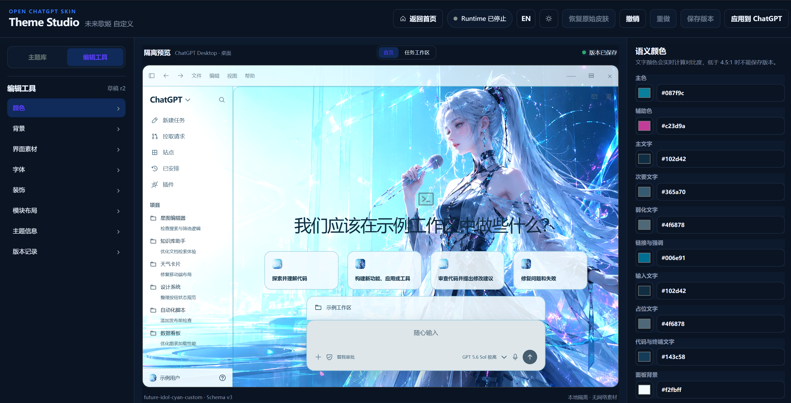
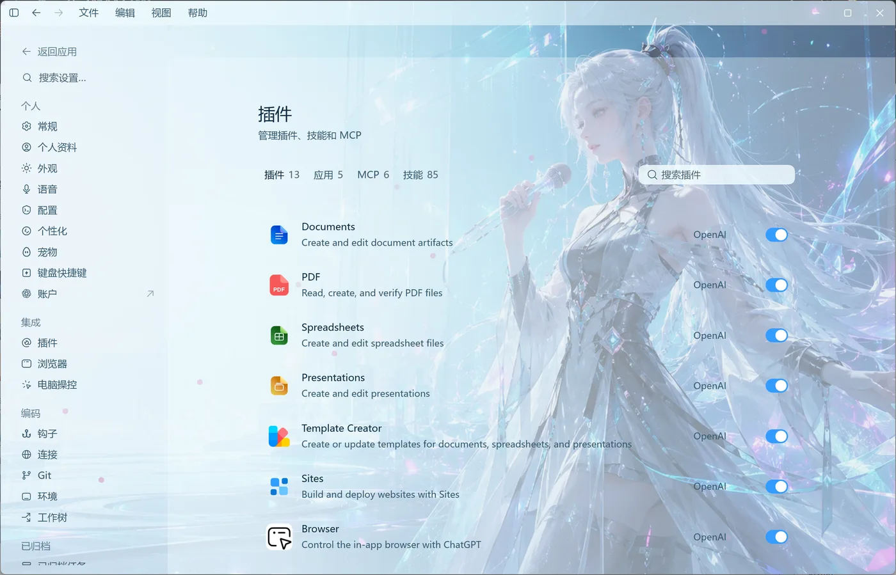
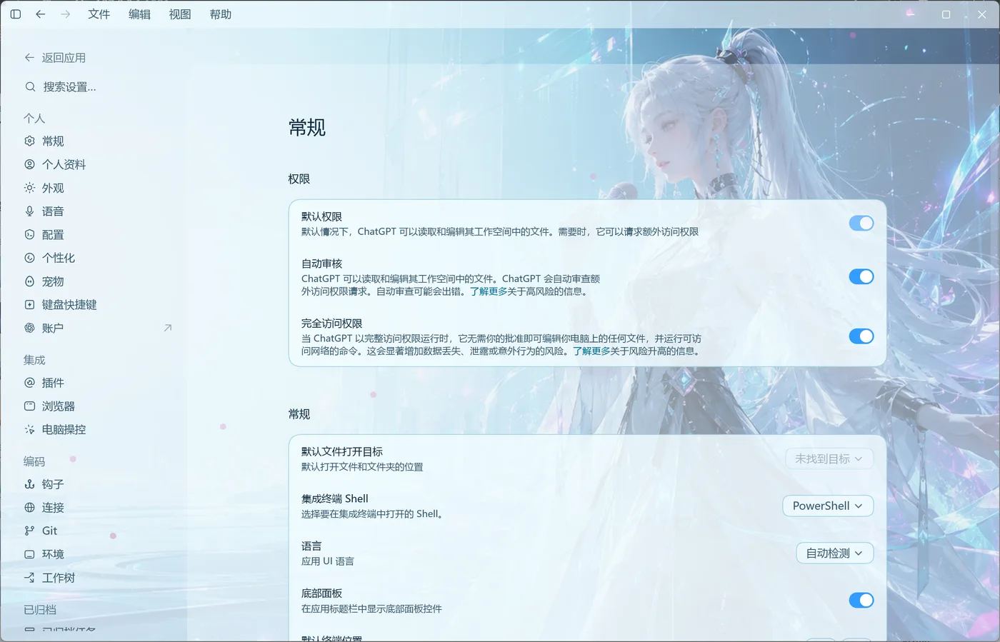
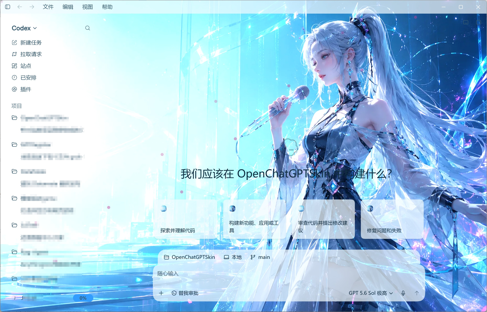
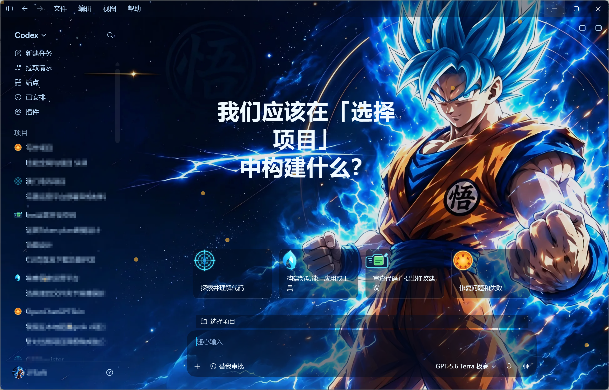
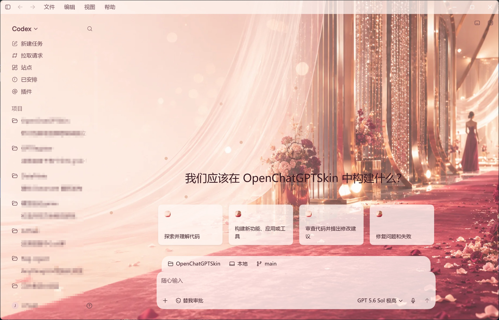
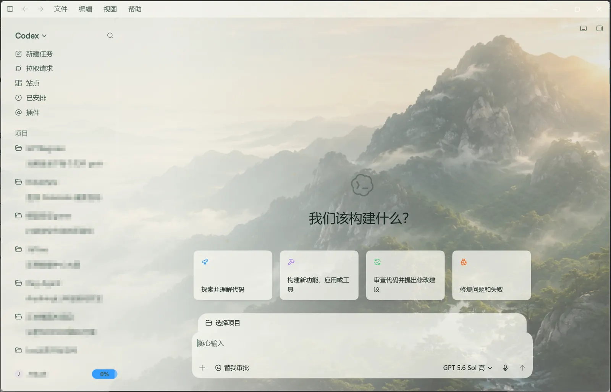
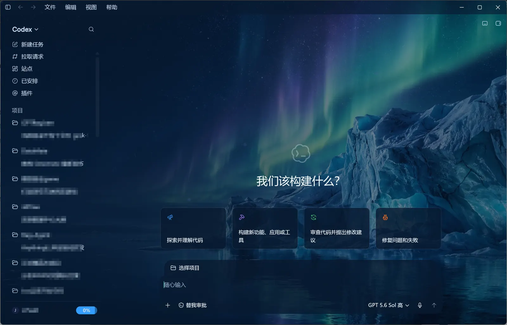

# OpenChatGPTSkin

[简体中文](README.md) · [English](README.en.md)

[](https://github.com/u2bo/OpenChatGPTSkin/releases/tag/v0.4.0)
[](https://u2bo.github.io/OpenChatGPTSkin-Community/zh-CN/themes)
[](https://u2bo.github.io/OpenChatGPTSkin-Community/zh-CN/submit)
[](https://github.com/u2bo/OpenChatGPTSkin/releases/tag/v0.4.0)
[](https://go.dev/)
[](https://www.typescriptlang.org/)
[](LICENSE)
[](https://linux.do/)

**OpenChatGPTSkin 是一个面向 Codex Desktop 的开源主题系统：不仅修改首页，而是把统一的颜色、背景、字体、装饰和安全布局投影到当前 Runtime 能识别的全部 Codex UI 表面。**

### Theme Studio 首页预览

<table>
  <tr>
    <td width="50%"></td>
    <td width="50%"></td>
  </tr>
  <tr>
    <td align="center">浅色首页</td>
    <td align="center">深色首页</td>
  </tr>
</table>

<details>
  <summary>查看 Theme Studio 主题编辑工作台</summary>
  <br>
  
</details>

> [!IMPORTANT]
> `v0.4.0` 正式接入已上线的社区主题目录。用户可以从 Theme Studio 或上方徽章浏览双语主题页面、真实截图、兼容状态、版本记录、文件大小和 SHA-256，也可以通过 Pull Request 投稿主题。Release 同时发布版本一致的 Theme Schema、Theme Core 与 Community Catalog 校验工具，社区 CI 会从源目录可复现地构建 `.ocskin`，而 Theme Studio 仍负责最终本地导入和安全校验。Windows x64、macOS ARM64 与 macOS x64 的六类安装/便携产物继续内置七个主题和 Node-free Theme CLI。macOS 产物仍未使用 Developer ID 正式签名或公证；应用主题前，请保存工作并**完全退出普通 ChatGPT**。OpenChatGPTSkin 不会修改 `WindowsApps`、`Codex.app`、`app.asar`、账号或 API 配置。

## 目录

- [项目介绍](#项目介绍)
- [主要能力](#主要能力)
- [全 UI 适配](#全-ui-适配)
- [社区主题与投稿](#社区主题与投稿)
- [内置主题](#内置主题)
- [安装](#安装)
- [快速开始](#快速开始)
- [自定义主题](#自定义主题)
- [Runtime 命令](#runtime-命令)
- [常见问题](#常见问题)
- [参与贡献](#参与贡献)
- [许可证](#许可证)

## 项目介绍

OpenChatGPTSkin 由三个相互约束的部分组成：

1. **Theme Schema 与 `.ocskin`**：定义可验证、可迁移、可分享的主题数据和本地素材格式。
2. **Theme Studio**：通过可视化界面编辑主题、隔离预览、保存不可变版本、导入导出并应用到真实 Codex。
3. **Desktop Runtime（Windows / macOS）**：安全启动受管理的官方 Codex，通过仅绑定 `127.0.0.1` 的 CDP 连接投影主题，并提供暂停、恢复和恢复原始外观能力。

项目坚持“主题是数据，不是任意代码”：主题包不能携带 JavaScript、HTML、CSS、可执行文件、远程素材 URL 或用户自定义 DOM 选择器。这样既能提供足够自由的视觉定制，也能保持可验证的恢复边界。

### 当前状态

| 能力 | 状态 |
|---|---|
| Theme Schema v4、`.ocskin` 校验/迁移/打包/解包 | 已完成 |
| 七个可直接使用的内置主题 | `v0.4.0` 正式包已包含 |
| Windows Runtime 启动、切换、暂停、恢复 | 正式版 |
| Windows x64 便携 ZIP 与用户级 Setup | 正式版 |
| macOS ARM64/x64 DMG、Runtime 启动/切换/恢复 | 未签名预览，双架构实机验收通过 |
| Theme Studio 编辑、预览、版本、导入导出、应用 | 正式版 |
| 安全模块化布局 | 已完成 |
| 社区主题目录、投稿审核与可校验下载 | 已上线，由独立社区仓库维护 |
| Community Catalog schema/CLI 与可复现发布工具 | `v0.4.0` 正式发布 |
| 自动更新、Windows/macOS 商业签名与公证 | 后续候选，需先建立发布信任链 |
| 真正单文件便携版 | 已延期，现有 Setup/ZIP/DMG 继续作为稳定渠道 |
| Codex 插件市场安装 | 受官方公开扩展能力限制，当前不可用 |

## 主要能力

- 编辑主色、辅助色、主/次/弱化文字、链接、输入、占位符、代码和状态颜色；
- 使用本地 PNG、JPEG、WebP 背景、人物前景和装饰素材；
- 配置系统字体或主题包内的 WOFF2 UI/代码字体；
- 调整明暗模式、背景焦点、缩放、模糊、亮度、遮罩和文字安全区；
- 配置基础面板、弹层和终端的透明度与毛玻璃；
- 使用模板化模块布局调整允许变更的顺序、间距、密度和宽度；
- 首页与任务工作区双视图隔离预览；
- 属性修改保留在当前编辑状态，只有点击“保存版本”才生成个人主题版本；
- 同一主题只保留一个草稿，重复打开时明确选择“加载已有草稿”或“覆盖现有草稿”；
- 导入、导出和 Runtime 命令行安装 `.ocskin`；
- 从 Theme Studio 直接打开社区目录，浏览、校验并投稿公开主题；
- 应用失败时保留旧外观或进入明确的恢复状态。

## 全 UI 适配

OpenChatGPTSkin 的目标不是在首页覆盖一张背景图。Runtime 使用统一的 surface contract 识别并适配当前 Codex Desktop 的主要 UI 表面：

| 区域 | 已适配示例 |
|---|---|
| 应用框架 | 主窗口、标题栏、侧边栏、顶部栏、应用菜单 |
| 首页与模式 | Hero、建议卡片、项目选择、输入框、Codex/ChatGPT、Chat/Work 切换 |
| 任务与历史 | 任务工作区、历史会话、资源卡片、文件块、侧边栏、终端和底部面板 |
| 功能页面 | 搜索、插件、已安排、拉取请求、站点及其工具栏和搜索框 |
| 设置 | 设置导航、设置面板、插件列表、环境、工作树及各类表单控件 |
| 浮层 | 菜单、模型选择、列表框、对话框、侧边栏弹层和滚动渐隐层 |

<table>
  <tr>
    <td width="33%"></td>
    <td width="33%"></td>
    <td width="33%"></td>
  </tr>
  <tr>
    <td align="center">ChatGPT / Work</td>
    <td align="center">插件页面</td>
    <td align="center">设置页面</td>
  </tr>
</table>

> Codex 更新可能改变内部 DOM。Runtime 会拒绝未经兼容性验证的结构，而不是静默注入；新版本适配请先运行兼容性 Probe 并补充固定页面测试。

## 社区主题与投稿

[OpenChatGPTSkin Community](https://u2bo.github.io/OpenChatGPTSkin-Community/zh-CN/themes) 是独立部署、双语、无追踪的公开主题目录。目前已收录全部七个现有主题；每个版本都展示真实首页/任务页截图、兼容状态、权利声明、文件大小和 SHA-256，并从社区仓库的不可变 GitHub Release 下载。

- [浏览社区主题](https://u2bo.github.io/OpenChatGPTSkin-Community/zh-CN/themes)：按关键词、明暗模式、兼容状态和标签筛选；
- [查看导入指南](https://u2bo.github.io/OpenChatGPTSkin-Community/zh-CN/install)：下载后核对哈希，再通过 Theme Studio 手动导入；
- [投稿一个主题](https://u2bo.github.io/OpenChatGPTSkin-Community/zh-CN/submit)：Fork 社区仓库，通过 Pull Request 接受公开审核；
- [举报问题](https://u2bo.github.io/OpenChatGPTSkin-Community/zh-CN/report)：报告权利、隐私、安全或兼容问题。

投稿时请提交可审查的 Theme Schema v4 源目录，而不是预先打包的 `.ocskin`。目录至少包含 `theme.json`、双语 `listing.json`、逐文件 `LICENSE.md`、封面以及真实首页和任务/会话截图。可信 CI 会统一校验素材边界、重新打包、回读归档并生成哈希；同一个 `theme-id + version` 一经发布不可覆盖，内容变化必须提升版本号。完整要求见[社区投稿指南](https://github.com/u2bo/OpenChatGPTSkin-Community/blob/main/CONTRIBUTING.md)。

> 社区收录基于投稿者的权利声明，并不等于独立法律核验。目录只负责发现和下载，不会后台安装主题；最终导入仍经过本地 Theme Core 校验。

## 内置主题

当前源码中的七个内置主题均包含完整主题配置、预览图、来源记录和 SHA-256，可以在干净检出后直接使用。前四个通用主题使用项目原创 AI 背景；三个角色主题使用项目维护者单独提供的素材及独立授权标识，不继承项目 MIT License。

### 未来歌姬 `future-idol-cyan`

清透的青蓝、银白和少量洋红强调色，适合喜欢明亮科幻氛围的用户；主视觉位于右侧，左侧保留文字安全区。



### 孙悟空·赛亚引擎 `goku-saiyan-engine`

深空蓝、电光青与战斗橙组成的高能创作主题。它保留右侧人物主视觉与左侧动态欢迎语安全区，配置雷达、能量、侦测器与七星能量球四张建议卡图标，以及项目图标和账户头像。



该角色背景及衍生裁剪使用独立授权标识，不自动纳入 MIT License，也不代表与原作品权利方存在官方合作。

### 星宫莓·闪耀舞台 `hoshimiya-ichigo-shining-stage`

莓红、粉金霓虹与偶像舞台灯光构成的明亮沉浸主题。人物和舞台来自项目维护者提供的 16:9 原始图；主题增加动态中英文欢迎语、四个粉金霓虹建议卡图标、项目图标和账户头像，并保持输入框及项目选择的官方交互几何。


该角色背景及衍生裁剪使用独立授权标识，不自动纳入 MIT License，也不代表与原作品权利方存在官方合作。

### 三上悠亚·星光粉 `yua-mikami-starlight`

柔粉霓虹、星光和授权人物背景构成的深色沉浸主题。它使用 Theme Schema v4 的中英文动态欢迎语、真实项目名插值、四个独立建议图标、项目图标、用户头像及四个不可交互视觉图层；展示字体使用随主题分发、依据 SIL Open Font License 1.1 授权的站酷小薇字体，并保留系统字体回退。


该主题的肖像与装饰素材来源网络；请参阅生成主题目录中的 `LICENSE.md`，不要将其误认为 MIT 素材。

### 玫瑰星光 `rose-carpet-star`

玫瑰金、香槟色和勃艮第红组成的暖色主题，面板使用轻盈半透明效果，适合柔和、优雅的桌面风格。



### 山岚云海 `mountain-mist`

以日出、云海和青绿色山体为主的浅色自然主题，文字对比温和，适合长时间工作。



### 冰川极光 `glacier-aurora`

深海军蓝、冰川青和极光紫构成的深色主题，适合低照度环境和偏好高对比界面的用户。



## 安装

### Windows Setup（推荐）

1. 在 [GitHub Releases](https://github.com/u2bo/OpenChatGPTSkin/releases/tag/v0.4.0) 下载 `OpenChatGPTSkin_0.4.0_windows_x64_Setup.exe` 和 `checksums.txt`。
2. 校验 SHA-256 后双击 Setup。安装范围为当前用户，默认目录是 `%LOCALAPPDATA%\Programs\OpenChatGPTSkin`，不请求管理员权限。
3. 从开始菜单启动 OpenChatGPTSkin；生产 Theme Studio 健康启动后会自动打开默认浏览器。

安装器未签名，Windows SmartScreen 可能显示警告。请只从本项目 GitHub Release 下载并先核对 `checksums.txt`；确认发布者来源和哈希后，再决定是否选择“更多信息 → 仍要运行”。

### Windows 便携 ZIP

下载 `OpenChatGPTSkin_0.4.0_windows_x64.zip`，校验后解压到可写且稳定的目录，双击 `OpenChatGPTSkin.exe`。便携版不会注册安装信息，也不依赖全局 Node.js、Go 或 Git；个人主题仍写入 `%LOCALAPPDATA%\OpenChatGPTSkin`，不会写入程序目录。

### macOS DMG（未签名开发者预览）

1. Apple Silicon（M 系列）下载 `OpenChatGPTSkin_0.4.0_macos_arm64.dmg`；Intel Mac 下载 `OpenChatGPTSkin_0.4.0_macos_x64.dmg`。两个架构均使用独立原生 Runner 构建并通过自动验收。
2. 先按下方命令核对 SHA-256，再打开 DMG，将 `OpenChatGPTSkin.app` 拖入 Applications。
3. 首次启动时按住 Control 点击或右键点击应用，选择“打开”，再确认 macOS 标准提示。不要关闭 Gatekeeper，也不要使用 `xattr` 移除隔离属性。
4. Theme Studio 健康启动后会自动打开默认浏览器。替换或删除 `.app` 不会删除 `~/Library/Application Support/OpenChatGPTSkin` 下的个人主题、草稿和 Runtime 状态。

开发者还可以下载同架构的 `OpenChatGPTSkin_0.4.0_macos_arm64.tar.gz` 或 `OpenChatGPTSkin_0.4.0_macos_x64.tar.gz`。压缩包内同样是完整 `OpenChatGPTSkin.app`；普通用户优先使用 DMG。

维护者可以进入仓库 **Actions → Build and Release → Run workflow** 手动触发 `workflow_dispatch`。三个原生 Runner 会分别构建并验收 Go Host，随后合并为 `go-release-combined`；手动运行不会创建 Tag 或 GitHub Release。

### 校验下载文件

在下载目录运行：

```powershell
Get-FileHash .\OpenChatGPTSkin_0.4.0_windows_x64.zip -Algorithm SHA256
Get-FileHash .\OpenChatGPTSkin_0.4.0_windows_x64_Setup.exe -Algorithm SHA256
Get-Content .\checksums.txt
```

macOS 终端：

```bash
shasum -a 256 OpenChatGPTSkin_0.4.0_macos_arm64.dmg
# Intel Mac 使用：
shasum -a 256 OpenChatGPTSkin_0.4.0_macos_x64.dmg
cat checksums.txt
```

输出哈希必须与 `checksums.txt` 中对应文件完全一致。任何不一致都应停止运行并重新下载。

### 从源码安装

源码开发需要 Windows 11 或 macOS、官方 Codex Desktop、Go `1.25.12`、Node.js `>= 22.0.0` 和 npm；Node 只用于前端、Contract 与 CDP Adapter 构建，不进入用户发布包。

从 GitHub 页面克隆或下载仓库，然后在仓库根目录运行：

```powershell
git clone https://github.com/u2bo/OpenChatGPTSkin.git
cd OpenChatGPTSkin
npm ci
npm run verify:foundation
```

`verify:foundation` 会重建主题目录、运行测试、执行类型检查、构建工作区，并校验当前源码中的七个内置主题。源码模式的命令都从仓库根目录运行。

### Windows 本地一键构建

Windows 开发者可以在仓库根目录用一条命令生成与 CI 相同结构的便携 ZIP、用户级 Setup 和 SHA-256 校验文件：

```powershell
npm run release:windows
```

本地构建需要 Go `1.25.12`、Node.js 22、npm 和 Inno Setup 6。命令会构建 Theme Studio 与单一 Go Host，生成 Node-free Stage、ZIP、Setup 和 SHA-256；最终产物位于 `artifacts/windows-x64/`。用户不需要安装这些开发工具。

从重命名前的开发版本升级时，首次启动 CLI 或 Theme Studio 会在新品牌数据目录不存在的前提下，原子迁移上一版本的个人主题、草稿和 Runtime 状态。若新旧目录同时存在，新目录优先，程序不会自动合并或覆盖任何一边。

覆盖安装新版 Setup、替换便携目录或替换 macOS `.app` 只更新程序文件，不迁移或覆盖 `%LOCALAPPDATA%\OpenChatGPTSkin` 或 `~/Library/Application Support/OpenChatGPTSkin`。Windows 卸载程序默认保留个人主题、草稿、版本和 Runtime 状态；仅在非静默卸载时明确选择“同时删除个人数据”并确认不可恢复提示，才会删除该数据目录。

## 快速开始

### 使用 Theme Studio（推荐）

1. 保存正在进行的工作，通过 Codex 菜单或系统托盘执行“退出 / Quit Codex”，确认普通 Codex 已完全退出。
2. Windows Setup 用户从开始菜单启动，便携版双击 `OpenChatGPTSkin.exe`；macOS 用户从“应用程序”启动 `OpenChatGPTSkin.app`；源码用户运行：

   ```powershell
   npm run studio:dev
   ```

3. 发布版会在随机 `127.0.0.1` 端口健康启动后自动打开浏览器；源码开发模式会输出可手动打开的地址。
4. 点击内置主题。没有已有草稿时会自动进入编辑工具；存在草稿时选择“加载已有草稿”或“覆盖现有草稿”，取消则保持主题库不变。
5. 调整颜色、背景、字体、装饰或安全模块布局，并在首页/任务工作区预览。
6. 点击“保存版本”。未保存的属性修改不会自动生成版本。
7. 点击“应用到 Codex”。Theme Studio 会把精确的 `{id, version}` 交给 Runtime。
8. 需要恢复时，使用 Theme Studio 右上角“恢复原始皮肤”；源码开发者也可运行 `npm run runtime -- restore`。

Theme Studio 首页默认链接到 `https://github.com/u2bo/OpenChatGPTSkin.git`。维护 fork 或镜像时，可在源码启动前设置 `OPEN_CHATGPT_SKIN_REPOSITORY_URL`；值只接受 `https://github.com/` 地址。

### 直接使用 Runtime（源码开发者）

```powershell
npm run runtime -- list-themes
npm run runtime -- launch --theme mountain-mist
npm run runtime -- switch --theme glacier-aurora
npm run runtime -- status
```

`launch` 前必须完全退出普通 Codex。Runtime 只管理自己启动的实例，不会接管或强制关闭已有 Codex。

## 自定义主题

请阅读完整的 [自定义主题指南](docs/custom-theme-guide.md)。它覆盖三条路径：

1. **AI 封装**：把背景图、视觉目标和授权信息交给 Codex/其他编码 Agent，使用文档中的可复制提示词生成、校验并打包 `.ocskin`；
2. **Theme Studio UI**：从内置主题开始，通过颜色、背景、字体、装饰和布局面板完成可视化定制；
3. **原生 Theme CLI**：让智能体直接调用最终 `OpenChatGPTSkin.exe` 或 macOS App 内的可执行文件创建、配置、检查、校验和打包主题。

主题格式、安全边界和所有字段范围见 [主题格式说明](docs/theme-format.md)。

### 通过最终构建物创建主题

Windows Setup 安装目录或便携 ZIP 解压目录中的 `OpenChatGPTSkin.exe` 已直接包含 CLI，不依赖 Node.js、npm 或 Go：

```powershell
.\OpenChatGPTSkin.exe theme help
.\OpenChatGPTSkin.exe theme create --dir D:\Themes\my-theme --id my-theme --name "我的主题" --author "Theme Agent" --background D:\Assets\background.png
.\OpenChatGPTSkin.exe theme config --dir D:\Themes\my-theme --patch D:\Assets\theme-patch.json
.\OpenChatGPTSkin.exe theme show --dir D:\Themes\my-theme
.\OpenChatGPTSkin.exe theme validate --dir D:\Themes\my-theme
.\OpenChatGPTSkin.exe theme pack --dir D:\Themes\my-theme --out D:\Themes\my-theme.ocskin
```

macOS 安装版调用同一个 App 可执行文件：

```bash
/Applications/OpenChatGPTSkin.app/Contents/MacOS/OpenChatGPTSkin theme help
```

成功结果写入 stdout，失败时 stderr 输出 `{"error":{"code":"...","message":"..."}}`。不带 `--background` 的 `create` 会生成草稿，先用 `validate --draft`；`create`、`pack`、`unpack` 都不会覆盖已有目标。源码开发时可使用 `npm run --silent theme -- ...`，它只是同一个 Go CLI 的适配器。

### `.ocskin` 导入导出

Theme Studio 可以直接导入或导出 `.ocskin`。Runtime 也支持从指定文件安装：

```powershell
npm run runtime -- import --theme-file "D:\Themes\personal-theme.ocskin"
```

主题包会验证 Schema、素材签名、文件大小、清单哈希和 Zip Slip 路径安全。导入命令不会启动 Controller，也不会连接 Codex。

## Runtime 命令

以下命令面向从源码运行的开发者；Setup 与便携版用户可在 Theme Studio 中完成应用、切换与恢复。

```powershell
npm run runtime -- list-themes
npm run runtime -- import --theme-file "D:\Themes\personal-theme.ocskin"
npm run runtime -- launch --theme mountain-mist
npm run runtime -- switch --theme glacier-aurora
npm run runtime -- pause
npm run runtime -- resume
npm run runtime -- status
npm run runtime -- restore
```

- `pause`：保留已选主题但停止对页面 DOM 投影；
- `resume`：重新应用已选主题；
- `restore`：恢复官方外观，并等待用户正常退出受管理 Codex 完成清理；
- 不要使用任务管理器强制结束恢复中的 Codex。

完整安全边界见 [Windows Runtime 说明](docs/runtime-windows.md) 与 [macOS Runtime 说明](docs/runtime-macos.md)。三个原生 Runner 会验证包结构、单一 Go Host、Theme Studio、当前源码中的七个内置主题及 Node-free manifest；真实 Codex 的视觉和生命周期闭环仍按对应平台文档在真实设备手动验收。

### Codex 更新后的真实验收

旧 Node Host 的 `runtime:probe` 与 `runtime:acceptance` 已随 Go cutover 删除，不再作为可执行入口。Codex 升级后，在无私人项目或敏感聊天的测试工作区完成以下检查：

1. 完全退出普通 Codex，依次检查七个内置主题、自定义主题、`pause`、`resume` 与 `restore`；
2. 从 Codex 菜单正常退出受管理实例，确认 Controller 和本地控制端点完成清理；
3. 正常启动官方 Codex，确认未继承远程调试参数且保持官方外观；
4. 记录 Codex/OpenChatGPTSkin/系统版本、结果和脱敏截图。

公开的验收记录不得包含 PID、端口、用户名、绝对路径、命令行、项目名或聊天内容。

Windows 与 macOS 的完整检查项分别见 [Windows Runtime 说明](docs/runtime-windows.md) 和 [macOS Runtime 说明](docs/runtime-macos.md)。

## 常见问题

### 为什么提示 `The Runtime command was rejected safely`？

这表示 Runtime 没有满足身份、状态或生命周期安全条件，因此拒绝执行。先运行：

```powershell
npm run runtime -- status
```

确认普通 Codex 已通过“退出 / Quit Codex”完全退出，再重新执行原命令。不要通过任务管理器或“强制退出”结束受管理实例；错误不会通过静默 fallback 被掩盖。

### 为什么不能直接在 Codex 插件页面安装？

OpenChatGPTSkin 是独立的本地 Theme Studio 与 Desktop Runtime，不是 Codex 插件市场插件。Windows 用户使用 GitHub Release 中的 Setup 或便携 ZIP，macOS 用户使用对应架构的 DMG；项目不会修改 Codex 安装包，也不会出现在 Codex 的插件页面。

### 为什么修改后“应用到 Codex”不可点击？

Theme Studio 不自动保存版本。请先处理对比度或素材校验问题，然后点击“保存版本”；只有已保存的精确版本可以应用或导出。

### 预览与真实 Codex 为什么可能有差异？

预览与 Runtime 共用颜色、背景、surface 和安全布局模型，但 Codex 自身更新可能改变内部结构。请记录 Codex 版本、页面路径和截图，并通过 Issue 提交；不要添加任意 CSS 或脆弱选择器来掩盖问题。

### 可以使用网络图片、商业字体或明星/动漫素材吗？

主题包只接受本地素材，不接受网络 URL。你必须拥有图片、字体和人物形象的使用与再分发权；不确定时将主题设为 `localOnly: true`，不要公开上传 `.ocskin`。

### 如何恢复官方皮肤？

优先使用 Theme Studio 的“恢复原始皮肤”或：

```powershell
npm run runtime -- restore
```

随后通过 Codex 菜单或系统托盘正常退出，完成清理。

## 项目结构

```text
apps/theme-studio/          Theme Studio React 前端
packages/theme-schema/      Theme Schema v4、迁移与视觉模型
packages/theme-core/        校验、目录、打包、存储
packages/cdp-adapter/       Codex UI surface 识别与主题编译
packages/theme-studio-core/ Theme Studio 合约与校验
host/go/                    单一 Go Studio、Controller、Runtime、Theme CLI 与平台适配
themes/builtin/             七个内置主题及素材来源记录
tests/                      Schema、Runtime、UI 和文档测试
```

## 参与贡献

欢迎参与 Codex 新版本适配、测试、文档、可访问性和安装体验建设。核心代码改动提交前请阅读 [贡献指南](CONTRIBUTING.md)。公开主题投稿请使用独立的[社区投稿流程](https://u2bo.github.io/OpenChatGPTSkin-Community/zh-CN/submit)，这样主题源码、权利声明、截图、审核记录和不可变 Release 会保存在同一条公开链路中。

核心仓库最小验证流程：

```powershell
npm ci
npm run test
npm run typecheck
npm run build
```

提交 UI 适配时，请同时提供对应的固定页面 fixture/测试。主题投稿必须提供来源、授权、Prompt/创作说明和素材哈希；不确定公开再分发权时请保留 `localOnly: true`，不要投稿。Issue 和 PR 中不要上传聊天内容、真实项目名称、用户名、路径、端口、令牌或其他敏感信息。

## 更多文档

- [v0.4.0 发布说明](docs/releases/v0.4.0.md)
- [v0.3.3 历史发布说明](docs/releases/v0.3.3.md)
- [v0.3.2 历史发布说明](docs/releases/v0.3.2.md)
- [v0.3.1 历史发布说明](docs/releases/v0.3.1.md)
- [v0.3.0 历史发布说明](docs/releases/v0.3.0.md)
- [v0.3.0-alpha.1 历史发布说明](docs/releases/v0.3.0-alpha.1.md)
- [v0.2.0 历史发布说明](docs/releases/v0.2.0.md)
- [v0.1.0 历史发布说明](docs/releases/v0.1.0.md)
- [v0.1.0-alpha.1 历史发布说明](docs/releases/v0.1.0-alpha.1.md)
- [自定义主题指南](docs/custom-theme-guide.md)
- [Theme Studio 开发说明](docs/theme-studio.md)
- [主题格式与安全规则](docs/theme-format.md)
- [Windows Runtime 与兼容性门](docs/runtime-windows.md)
- [macOS Runtime 与实机验收](docs/runtime-macos.md)

## 许可证

源代码和项目文档采用 [MIT License](LICENSE)。内置主题的背景、预览、来源图以及本文档中的产品截图不自动纳入 MIT，分别受主题目录内 `LICENSE.md`、主题 `rights` 元数据和素材所有者授权约束。用户导入素材的版权与再分发责任由用户承担。

## 免责声明

OpenChatGPTSkin 是社区项目，与 OpenAI 无隶属或官方合作关系。“Codex”“ChatGPT”和相关产品名称属于其各自权利人。项目不会修改官方安装包、绕过签名或访问账号/API 凭据；Codex 更新仍可能要求 Runtime 适配。
