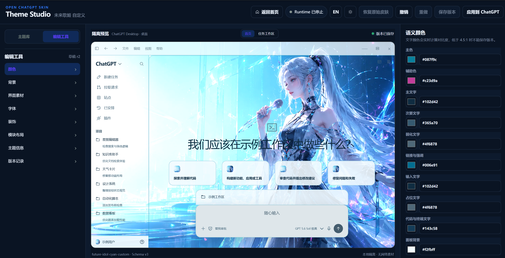

# OpenChatGPTSkin 自定义主题指南

[简体中文](custom-theme-guide.md) · [English](custom-theme-guide.en.md) · [返回 README](../README.md)

本指南介绍两种自定义主题方式：

1. 使用 Codex 或其他编码 Agent，根据提示词把本地素材封装成可验证、可分享的 `.ocskin`；
2. 使用 Theme Studio 的内置 UI，从主题库开始进行可视化定制。



> [!IMPORTANT]
> Windows x64 用户可使用 GitHub Release 的 Setup 或便携 ZIP；macOS 用户可使用对应架构的未签名 DMG，Windows/macOS 开发者也可从源码运行。应用主题前必须完全退出普通 Codex。主题只允许数据和本地素材，不能包含任意 JavaScript、HTML、CSS、可执行文件、网络素材 URL 或自定义 DOM 选择器。macOS 的真实应用视觉验收仍需按 [macOS Runtime 说明](runtime-macos.md) 在 Mac 上完成，不能把包验收当作真实 Codex UI 已通过的证据。

## 选择哪种方式

| 方式 | 适合人群 | 优点 | 需要了解的内容 |
|---|---|---|---|
| AI 封装 `.ocskin` | 熟悉 Git/命令行，希望批量生成或精确控制配置 | 可复用、可审查、适合提交 PR | 本地素材路径、授权、目标风格 |
| Theme Studio UI | 希望所见即所得、反复预览 | 上手快、带校验、可直接应用 | 无需手写 JSON |

两种方式产生相同的 Theme Schema v3 数据，可以相互导入导出。推荐先用 Theme Studio 找到满意效果，再导出 `.ocskin`；需要批量或自动化时再使用 AI 封装。

## 可定制范围

| 分类 | 可配置项 |
|---|---|
| 颜色 | 主色、辅助色、主/次/弱化文字、链接、输入、占位、代码/终端文字、面板、边框、成功/警告/错误/信息 |
| 背景 | 图片、人物前景、界面明暗、焦点、缩放、模糊、亮度、遮罩、文字安全区、任务页模式与透明度 |
| Surface | 基础面板、弹层、终端透明度和毛玻璃 |
| 字体 | UI/代码字体族、字号、缩放、字重、行高、本地 WOFF2 字体 |
| 装饰 | 粒子、丝带、蝴蝶、拍立得、徽章、闪光和本地图片装饰 |
| 布局 | 允许调整的模块顺序、显隐、尺寸、对齐、间距、侧边栏密度、输入区宽度和卡片列数 |
| 信息 | 主题 ID、名称、描述、版本、作者和权利元数据 |

项目选择、侧边栏、顶部栏、输入区和内容层等受保护区域必须保持可见。项目选择组件始终使用 Codex 官方大小、位置和层级，只适配主题颜色；Theme Studio 不接受任意坐标、覆盖层或 CSS。

## 方式一：使用 AI 封装主题

### 1. 准备素材和需求

准备以下信息：

- 一张 16:9 背景图，建议至少 `1600 × 900`，PNG/JPEG/WebP，单文件不超过 16 MB；
- 可选人物前景、装饰图和 WOFF2 字体；
- 主题名称、英文 ID（如 `my-forest-theme`）、作者、版本；
- 浅色/深色倾向、主要颜色、主体焦点和文字安全区；
- 每个素材的来源与授权。

如果只是本地自用或授权不确定，必须使用：

```json
{
  "licenseId": "LicenseRef-User-Supplied",
  "localOnly": true
}
```

不要把授权不明确、带真人肖像、商业字体、Logo 或受版权保护角色的主题公开分享。

### 2. 可复制的 AI 封装提示词

把背景图附加给 Codex/编码 Agent，并在 OpenChatGPTSkin 仓库根目录使用下面的提示词。替换尖括号中的内容：

```text
你正在 OpenChatGPTSkin 仓库中工作。请把我提供的本地素材封装成一个安全、可验证的
Theme Schema v3 主题和 .ocskin 文件，不要修改 Runtime、Theme Studio 或其他业务代码。

主题要求：
- 主题名称：<中文或英文名称>
- 主题 ID：<小写英文和连字符，例如 my-forest-theme>
- 作者：<作者名称>
- 起始版本：1.0.0
- 界面倾向：<auto / light / dark>
- 视觉描述：<希望的氛围、主色、辅助色、文字颜色>
- 背景主体位置：<left / center / right>
- 文字安全区：<left / center / right / none>
- 任务页背景：<full / ambient / banner / off>
- 素材来源与授权：<来源、许可证、是否允许再分发>
- 是否仅本地使用：<true / false>

实施约束：
1. 完整阅读 docs/theme-format.md，并以 themes/builtin/mountain-mist 为结构参考。
2. 在一个新的主题目录中创建 theme.json、assets/ 和可选 preview.webp。
3. 只使用我明确提供的本地 PNG/JPEG/WebP/WOFF2 素材，不下载网络资源。
4. 不写 JavaScript、HTML、CSS、可执行文件、任意 DOM 选择器或隐藏 fallback。
5. 使用 Theme Schema v3 的完整语义颜色；主文字、输入文字和代码文字必须可读，
   对比度不低于 Theme Studio 的保存门槛。
6. 根据背景主体设置 positionX/positionY、safeArea、overlay、brightness、surfaces，
   确保真实 Codex 的菜单、设置、历史、任务、终端和输入框都能读取内容。
7. 受保护布局必须保持可见；project-picker 使用官方几何，不要试图改变其坐标或层级。
8. rights 必须真实反映授权。不确定时设置 licenseId=LicenseRef-User-Supplied、
   localOnly=true，且不要声称可公开再分发。
9. 先运行 npm run build，再运行：
   node packages/theme-core/dist/cli.js validate --dir <主题目录>
   node packages/theme-core/dist/cli.js pack --dir <主题目录> --out <主题ID>-1.0.0.ocskin
10. 输出验证结果、生成文件路径、主题配置摘要和仍需我确认的授权风险。

不要吞掉校验错误；任何失败都应保留原始错误码并修复根因后重新验证。
```

### 3. 可复制的背景图生成提示词

如果还没有背景图，可以把以下模板交给图像生成模型。主题 UI 需要“视觉主体区 + 低细节文字安全区”，不要把整张图铺满高频细节。

```text
生成一张原创 16:9、4K 桌面主题背景图，用于 Codex Desktop UI。
风格：<自然 / 科幻 / 极简 / 复古 / 其他>。
主视觉：<主体描述>，放在画面<右侧/左侧>，细节清晰但不要触碰窗口边缘。
在画面<左侧/右侧>保留大面积低细节、低对比、无文字的 UI 安全区，
用于侧边栏、标题、卡片和输入框。色彩以<主色>为主，辅以<辅助色>，
避免纯白高光遮挡文字。不要包含 Logo、品牌标识、文字、水印、已知角色、
名人肖像或受版权保护的独特服装特征。画面应适合半透明面板叠加。
```

生成后仍需人工检查人物/品牌相似性和授权。AI 生成不自动等于可公开再分发。

### 4. 主题目录结构

AI 最终应生成类似结构：

```text
my-theme/
├── theme.json
├── preview.webp                 # 可选，最多 2 MB
├── assets/
│   ├── background.webp          # theme 必需
│   ├── portrait.webp            # 可选
│   ├── profile-avatar.webp       # 可选，账户头像
│   ├── suggestion-card1.webp     # 可选，建议卡片 1；其余卡片同理
│   └── decorations/             # 可选
└── fonts/
    └── ui.woff2                  # 可选
```

`manifest.json` 由打包命令根据实际文件、字节数和 SHA-256 生成，不需要手工维护。

### 5. 验证和打包

```powershell
npm run build
node packages/theme-core/dist/cli.js validate --dir D:\Themes\my-theme
node packages/theme-core/dist/cli.js pack --dir D:\Themes\my-theme --out D:\Themes\my-theme-1.0.0.ocskin
```

输出采用“只创建”策略。目标 `.ocskin` 已存在时命令会拒绝覆盖，请修改版本或输出文件名，不要删除旧版本伪装成原子更新。

### 6. 导入和试用

可以在 Theme Studio 主题库点击“导入”，也可以使用 Runtime：

```powershell
npm run runtime -- import --theme-file "D:\Themes\my-theme-1.0.0.ocskin"
npm run runtime -- launch --theme my-theme
```

运行 `launch` 前必须完全退出普通 Codex。

## 方式二：使用 Theme Studio UI

### 1. 启动

```powershell
npm ci
npm run studio:dev
```

打开命令输出的一次性 `127.0.0.1` 地址。Theme Studio 只绑定本机回环地址。

### 2. 选择或导入主题

- 点击任意内置主题后会自动加载并切换到“编辑工具”；
- 如果该主题已经有草稿，会提示“加载已有草稿”或“覆盖现有草稿”；
- 点击“取消”会关闭提示并保持主题库不变；
- 一个主题只有一个草稿和一个个人主题身份，不会因反复打开生成重复卡片；
- 也可以从主题库导入已有 `.ocskin`。

### 3. 编辑颜色

建议按顺序设置：

1. 面板背景和边框；
2. 主文字、次要文字、弱化文字；
3. 输入、占位和代码/终端文字；
4. 主色、辅助色、链接和状态色。

Theme Studio 会显示对比度和 Schema 检查。任何错误都会阻止保存版本，不会静默替换你的颜色。

### 4. 上传背景和素材

在“背景”中上传本地 PNG/JPEG/WebP，并调整：

- 界面明暗；
- 背景焦点、缩放、模糊、亮度和遮罩；
- 文字安全区；
- 任务页背景模式和透明度；
- 基础面板、弹层、终端的透明度与毛玻璃。

遮罩越低背景越清晰，但文字可读性会下降。先确定文字安全区，再降低遮罩。

在“界面素材”中可以分别配置用户头像和四个建议卡片图片。每个槽位支持上传/替换、清除或复用主题背景；清除后恢复 ChatGPT 官方视觉。头像会归一化为 `256×256 WebP`，建议卡片图片会归一化为 `192×192 WebP`，修改只进入当前草稿，仍需点击“保存版本”才会产生新版本。

### 5. 字体、装饰和布局

- 字体：配置 UI/代码字体、字号、缩放、字重和行高；自带字体必须是 WOFF2；
- 装饰：最多 16 个非交互装饰层；
- 布局：调整允许变更的模块，不要尝试改变项目选择的官方几何。

### 6. 预览

在中间隔离预览顶部切换“首页 / 任务工作区”。同时检查：

- 背景焦点是否遮挡文字；
- 浅色/深色文字和链接是否可读；
- 输入框、卡片、菜单、终端是否与主题一致；
- 首页与任务页的透明度是否都合适。

隔离预览和 Runtime 共用视觉模型，但真实 Codex 版本仍可能改变 DOM。发现差异时记录 Codex 版本和页面路径，修复适配器而不是加入任意 CSS。

### 7. 保存、应用和导出

Theme Studio **不会自动保存版本**：

1. 属性修改仅更新当前编辑和预览；
2. 点击“保存版本”才写入个人主题版本；
3. 已保存的精确 `{id, version}` 才能“应用到 Codex”或导出；
4. 需要分享时从主题信息/版本区域导出 `.ocskin`。

应用前必须完全退出普通 Codex。需要恢复时点击右上角“恢复原始皮肤”，随后正常退出受管理 Codex 完成清理。

## 版本和草稿规则

- 主题 ID 一旦发布应保持稳定；
- 版本使用 `major.minor.patch`；
- 已保存版本不可变；
- 同主题第二次打开不会新建重复草稿；
- “加载已有草稿”保留当前工作，“覆盖现有草稿”以选中主题重新开始；
- 删除个人主题时会删除同组旧别名、版本和草稿。

## 素材和包限制

| 项目 | 限制 |
|---|---:|
| 用户选择的源图片 | 50 MB |
| 处理后的单张 PNG/JPEG/WebP | 16 MB |
| `preview.webp` | 2 MB |
| 单个 WOFF2 字体 | 5 MB |
| 压缩后的 `.ocskin` | 32 MB |
| 解包后的主题总大小 | 32 MB |

详细路径、签名、Schema 和错误码见 [主题格式说明](theme-format.md)。

## 发布主题前检查

- [ ] ID、名称、作者和版本正确；
- [ ] 首页、任务、历史、设置、插件、菜单、输入框和终端可读；
- [ ] 四个建议卡片图片和账户头像裁切正确，清除后能恢复官方视觉；
- [ ] 主文字、输入文字和代码文字通过对比度检查；
- [ ] 项目选择使用官方大小和位置；
- [ ] 不包含网络 URL、脚本、CSS、可执行文件或任意选择器；
- [ ] 所有图片和字体都有可验证授权；
- [ ] 公共主题包含 attribution；
- [ ] `validate` 和 `pack` 成功；
- [ ] 在真实 Codex 中试用并成功恢复官方皮肤；
- [ ] 截图已经移除项目名、用户名、聊天内容、路径和令牌。

## 常见问题

### 保存版本按钮不可用

检查右侧校验结果，修复对比度、缺失素材或 Schema 错误。只有存在未保存修改且校验通过时才能保存。

### 应用到 Codex 按钮不可用

先点击“保存版本”。Theme Studio 不允许把未保存的临时状态直接应用到 Runtime。

### 背景没有显示或过于模糊

确认背景是本地 PNG/JPEG/WebP，并检查缩放、模糊、亮度、遮罩、任务页模式和 surface 透明度。不要通过网络 URL 引用图片。

### Runtime 安全拒绝命令

```powershell
npm run runtime -- status
```

确认普通 Codex 已正常完全退出，再重试。不要使用任务管理器强制结束受管理 Codex。

### 如何恢复原始外观

```powershell
npm run runtime -- restore
```

然后通过 Codex 菜单或系统托盘正常退出，完成恢复清理。
